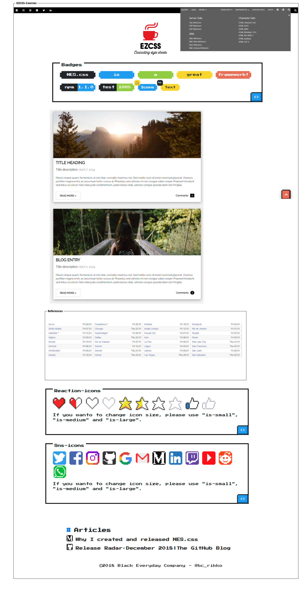

# Prerequisites

## Landing page for the prerequisites

> Mockup



## BreakDown

> layout

```ezcss
body
  header (shared UI )
    section.top-bar (1)
    section.hero (2)
  main (unique content for each page)
    section.badges (3)
    section.posts (4)
    section.preferences (5)
  footer (shared UI)
    section.reactions (6)
    section.sns (7)
    section.footer (8)
```

### Details

> 1.section.top-bar

```ezcss
section.top-bar
  div.container-fluid
    div.row
      div.col-6
        ul.top-bar__social_links > li*6 > a > span.fa-icon
      div.col-6
        ul.top-bar__nav
          li > a > span.fa-search
          li > a >
            span
            div.top-bar__nav__menu
              ul
                li:first-child
                li
```

> 2.section.hero

```ezcss
section.hero
  div.container
    a > img
```

> 3.section.badges

```ezcss
section.badges
  div.container
    h2.badges__title
    ul > li > a
```

> 4.section.posts

```ezcss
section.posts
  div.container
    div.row
      div.col-8 * 2 > div.posts__item ( background-image )
        h3.posts__item__title
        p.posts__item__description > span.posts__item__description__date
        p.posts__item__excerpt
        p
          a.posts__item__readmore
          a.posts__item__comments
```

> 5.section.references

```ezcss
section.references
  div.container
    table.references__list
      thead > tr > th * 3
      tbody > (tr > td * 3)*10
```

> 6.section.reaction-icons

```ezcss
section.reactions
  div.container
    div.reactions__likes
      facebook_like
      google_like
      twitter_share
    p.reactions__quote
```

> 7.section.sns-icons

```ezcss
section.sns-icons
  div.container
    ul.sns-icons__links > li > a > i.fa
    p.sns-icons__quote
```

> 8.section.footer

```ezcss
section.footer
  h2.footer__title
  ul.footer__quotes
    li
      i.fa
    li
      i.fa
  p.footer__copyright
```

## Ref

- https://www.w3schools.com/css/css_rwd_intro.asp
- https://www.w3schools.com/cssref/css_functions.asp
- https://www.codecademy.com/learn/learn-css/modules/learn-css-typography
- https://www.tutorialspoint.com/css/css_measurement_units.htm
- https://www.tutorialspoint.com/css/css_animation.htm
- https://www.tutorialspoint.com/css/css_media_types.htm
- https://www.smashingmagazine.com/native-css-masonry-layout-css-grid/
- https://masonry.desandro.com/
- https://w3bits.com/css-masonry/
